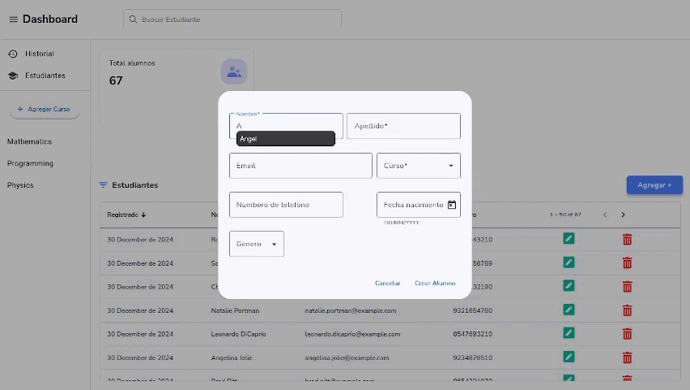
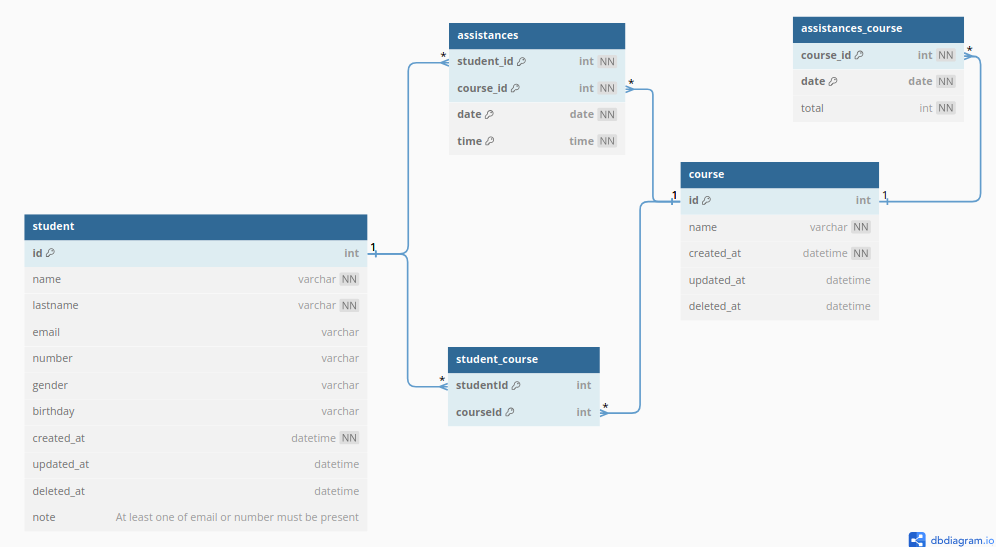

<h1>Hi there!</h1>

  

  
  
 
  
  
    
  

  

Hi, I'm Joseph. I consider myself a <b>backend developer</b>, although I have also worked in frontend development.

## About me

Currently, I am focused on deepening my knowledge in **Design Patterns**, **Microservices Architecture**, **Concurrency Management**, and **Data Structures**.

My professional goal is to become a **Tech Lead**, capable of leading development teams and designing scalable architectures that drive high-impact projects.

I define myself as a self-taught person, capable of constantly learning and improving, facing new challenges with enthusiasm and commitment.

## Code  

### Git Activeness 

&nbsp;

     

### Top Repositories

  <h4 align="center" style="border-bottom: 1px solid #fff" >Student Management</h4>

<table align="center">
  <tr>
    <td align="center">
      
 
 
  
  
  
  

    </td>
    <td align="center">
      
      
   
         
        

    </td>
  </tr>
</table>

## Contact

  

